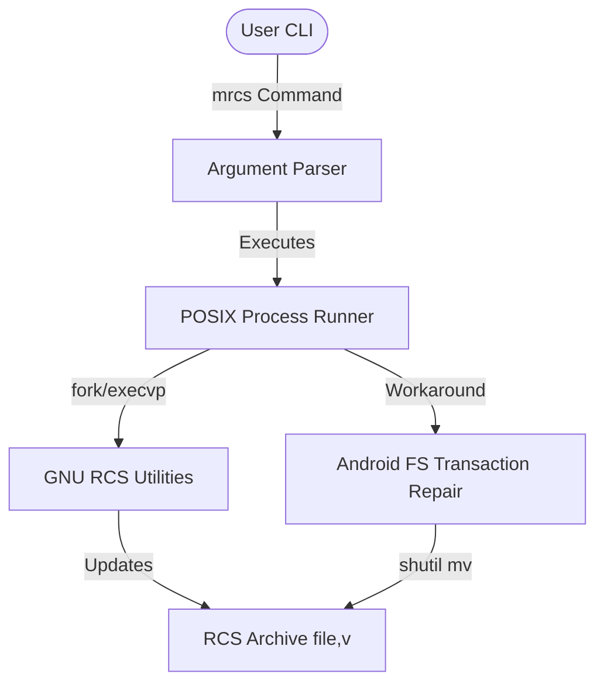

# mrcs Overview

Modern Revision Control System (`mrcs`) is a version control system optimized for tracking history on **individual files** rather than entire workspaces.

## Mission

> "Version one file with zero friction."

`mrcs` targets individual files where initializing a full Git repository is overkill or distracting. Common use cases include:
- `README.md`
- `TODO.md`
- `changelog.md`
- `config.json`
- `notes.txt`

---

## Current State (Stage 1)

Stage 1 is **fully complete, tested, and shipped**. It runs as a highly secure POSIX process wrapper around GNU RCS.

### System Architecture
The application is written in standard ISO C99 (`mrcs.c`) and compiles warning-free under both `gcc` and `clang` (making it cross-platform compatible with Linux, macOS, and Termux/Android).

### CLI Command List
- `mrcs init <file>`: Sets up an `RCS/` directory and registers a file under non-strict locking.
- `mrcs commit [file] [-m "message"]`: Saves a new revision. Prompts for message via terminal text editor (e.g. `nano`) if `-m` is omitted.
- `mrcs log [file]`: Shows formatted and indented revision history.
- `mrcs diff [args]`: Prints a colorized unified diff.
- `mrcs restore <rev> [file]`: Restores the working copy to an older revision (unlocked/writable).
- `mrcs status [file]`: Reports working copy state (`clean`, `modified`, `uncommitted`, `untracked`).
- `mrcs show [file]`: Shows the diff introduced by the most recent commit (comparing previous revision to HEAD).
- `mrcs current [file]`: Outputs current HEAD revision.
- `mrcs list`: Tabulates all tracked files in the current folder along with their current revision and status.
- `mrcs delete <rev> [file]`: Permanently removes a revision from the archive history.
- `mrcs help`: Renders a clean colorized help screen.

---

## RCS Feature Coverage (Stage 1 Wrapper)

`mrcs` does not wrap every utility or legacy feature in the GNU RCS suite. Instead, it carefully selects and simplifies the core workflow of RCS to match modern developer standards.

### Wrapped Features
- **Initialization**: `mrcs init` wraps `rcs -i` (initialize) and `rcs -U` (disable strict locking).
- **Check-in**: `mrcs commit` wraps `ci -u` (check in and keep checked out unlocked/writable).
- **Check-out**: `mrcs restore` wraps `co -f -u -r` (forced checkout unlocked).
- **History Log**: `mrcs log` wraps `rlog` (parsed and prettified).
- **Differences**: `mrcs diff` wraps `rcsdiff -u` (unified format, colorized).
- **Show Commit**: `mrcs show` wraps `rcsdiff -u -r<rev1> -r<rev2>` (compares previous revision to HEAD).
- **History Pruning**: `mrcs delete` wraps `rcs -o` (outdates/deletes a revision).

### Intentionally Excluded Features
- **Strict File Locking**: RCS defaults to strict lock-on-checkout (`rcs -L`), preventing other users/editors from editing a file unless locked. `mrcs` disables this by default (`rcs -U`) to align with Git's unlock-based workflow.
- **Access Control Lists**: Legacy RCS permissions commands (`rcs -a` to append user logins, `rcs -e` to erase them) are skipped to simplify multi-user management.
- **Merging & Keyword Cleaning**: Utilities like `rcsmerge` (merging edits from different revisions) and `rcsclean` (deleting unmodified checked-out files) are omitted.
- **Keyword Identification**: The `ident` tool (extracting keywords like `$Id$`) is skipped to prevent file pollution.
